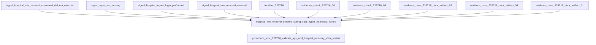

# hospital_tote_removal_blocked_during_cat1_tipper_heartbeat_failure

```mermaid
flowchart TD
  workflow[hospital_tote_removal_blocked_during_cat1_tipper_heartbeat_failure]
  hospital_tote_removal_command_did_not_execute[signal_hospital_tote_removal_command_did_not_execute] --> workflow
  agvs_are_moving[signal_agvs_are_moving] --> workflow
  hospital_logout_login_performed[signal_hospital_logout_login_performed] --> workflow
  hospital_tote_removal_restored[signal_hospital_tote_removal_restored] --> workflow
  workflow --> proc_229716_validate_agv_and_hospital_recovery_after_restart[procedure_proc_229716_validate_agv_and_hospital_recovery_after_restart]
  229716[incident_229716] --> workflow
  chunk_229716_04[evidence_chunk_229716_04] --> workflow
  chunk_229716_08[evidence_chunk_229716_08] --> workflow
  case_229716_docx_artifact_03[evidence_case_229716_docx_artifact_03] --> workflow
  case_229716_docx_artifact_04[evidence_case_229716_docx_artifact_04] --> workflow
  case_229716_docx_artifact_11[evidence_case_229716_docx_artifact_11] --> workflow
```
