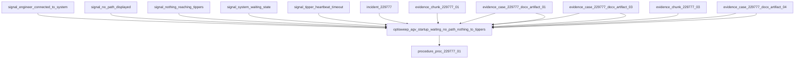

# optisweep_agv_startup_waiting_no_path_nothing_to_tippers

```mermaid
flowchart TD
  workflow[optisweep_agv_startup_waiting_no_path_nothing_to_tippers]
  engineer_connected_to_system[signal_engineer_connected_to_system] --> workflow
  no_path_displayed[signal_no_path_displayed] --> workflow
  nothing_reaching_tippers[signal_nothing_reaching_tippers] --> workflow
  system_waiting_state[signal_system_waiting_state] --> workflow
  tipper_heartbeat_timeout[signal_tipper_heartbeat_timeout] --> workflow
  workflow --> proc_229777_01[procedure_proc_229777_01]
  229777[incident_229777] --> workflow
  chunk_229777_01[evidence_chunk_229777_01] --> workflow
  case_229777_docx_artifact_01[evidence_case_229777_docx_artifact_01] --> workflow
  case_229777_docx_artifact_03[evidence_case_229777_docx_artifact_03] --> workflow
  case_229777_docx_artifact_04[evidence_case_229777_docx_artifact_04] --> workflow
  chunk_229777_03[evidence_chunk_229777_03] --> workflow
  case_229777_docx_artifact_01[evidence_case_229777_docx_artifact_01] --> workflow
  case_229777_docx_artifact_03[evidence_case_229777_docx_artifact_03] --> workflow
  case_229777_docx_artifact_04[evidence_case_229777_docx_artifact_04] --> workflow
```
