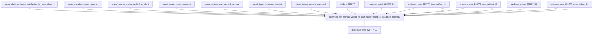

# optisweep_agv_startup_waiting_no_path_tipper_heartbeat_candidate_recovery

```mermaid
flowchart TD
  workflow[optisweep_agv_startup_waiting_no_path_tipper_heartbeat_candidate_recovery]
  client_confirmed_satisfaction_for_case_closure[signal_client_confirmed_satisfaction_for_case_closure] --> workflow
  everything_came_back_on[signal_everything_came_back_on] --> workflow
  master_e_stop_applied_by_client[signal_master_e_stop_applied_by_client] --> workflow
  service_restart_required[signal_service_restart_required] --> workflow
  system_back_up_and_running[signal_system_back_up_and_running] --> workflow
  tipper_heartbeat_timeout[signal_tipper_heartbeat_timeout] --> workflow
  tippers_paused_unpaused[signal_tippers_paused_unpaused] --> workflow
  workflow --> proc_229777_02[procedure_proc_229777_02]
  229777[incident_229777] --> workflow
  chunk_229777_04[evidence_chunk_229777_04] --> workflow
  case_229777_docx_artifact_01[evidence_case_229777_docx_artifact_01] --> workflow
  case_229777_docx_artifact_03[evidence_case_229777_docx_artifact_03] --> workflow
  case_229777_docx_artifact_04[evidence_case_229777_docx_artifact_04] --> workflow
  chunk_229777_05[evidence_chunk_229777_05] --> workflow
  case_229777_docx_artifact_01[evidence_case_229777_docx_artifact_01] --> workflow
  case_229777_docx_artifact_03[evidence_case_229777_docx_artifact_03] --> workflow
  case_229777_docx_artifact_04[evidence_case_229777_docx_artifact_04] --> workflow
```
