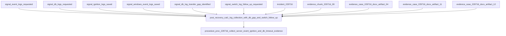

# post_recovery_cat1_log_collection_with_db_gap_and_switch_follow_up

```mermaid
flowchart TD
  workflow[post_recovery_cat1_log_collection_with_db_gap_and_switch_follow_up]
  event_logs_requested[signal_event_logs_requested] --> workflow
  db_logs_requested[signal_db_logs_requested] --> workflow
  ignition_logs_saved[signal_ignition_logs_saved] --> workflow
  windows_event_logs_saved[signal_windows_event_logs_saved] --> workflow
  db_log_transfer_gap_identified[signal_db_log_transfer_gap_identified] --> workflow
  switch_log_follow_up_requested[signal_switch_log_follow_up_requested] --> workflow
  workflow --> proc_229716_collect_server_event_ignition_and_db_timeout_evidence[procedure_proc_229716_collect_server_event_ignition_and_db_timeout_evidence]
  229716[incident_229716] --> workflow
  chunk_229716_09[evidence_chunk_229716_09] --> workflow
  case_229716_docx_artifact_04[evidence_case_229716_docx_artifact_04] --> workflow
  case_229716_docx_artifact_11[evidence_case_229716_docx_artifact_11] --> workflow
  case_229716_docx_artifact_12[evidence_case_229716_docx_artifact_12] --> workflow
```
