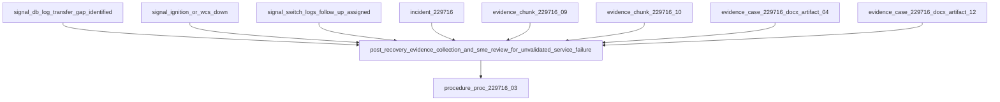

# post_recovery_evidence_collection_and_sme_review_for_unvalidated_service_failure

```mermaid
flowchart TD
  workflow[post_recovery_evidence_collection_and_sme_review_for_unvalidated_service_failure]
  db_log_transfer_gap_identified[signal_db_log_transfer_gap_identified] --> workflow
  ignition_or_wcs_down[signal_ignition_or_wcs_down] --> workflow
  switch_logs_follow_up_assigned[signal_switch_logs_follow_up_assigned] --> workflow
  workflow --> proc_229716_03[procedure_proc_229716_03]
  229716[incident_229716] --> workflow
  chunk_229716_09[evidence_chunk_229716_09] --> workflow
  chunk_229716_10[evidence_chunk_229716_10] --> workflow
  case_229716_docx_artifact_04[evidence_case_229716_docx_artifact_04] --> workflow
  case_229716_docx_artifact_12[evidence_case_229716_docx_artifact_12] --> workflow
```
