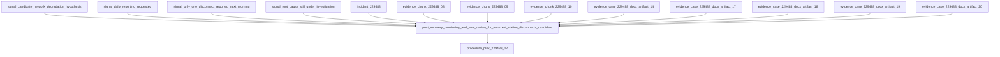

# post_recovery_monitoring_and_sme_review_for_recurrent_station_disconnects_candidate

```mermaid
flowchart TD
  workflow[post_recovery_monitoring_and_sme_review_for_recurrent_station_disconnects_candidate]
  candidate_network_degradation_hypothesis[signal_candidate_network_degradation_hypothesis] --> workflow
  daily_reporting_requested[signal_daily_reporting_requested] --> workflow
  only_one_disconnect_reported_next_morning[signal_only_one_disconnect_reported_next_morning] --> workflow
  root_cause_still_under_investigation[signal_root_cause_still_under_investigation] --> workflow
  workflow --> proc_229488_02[procedure_proc_229488_02]
  229488[incident_229488] --> workflow
  chunk_229488_08[evidence_chunk_229488_08] --> workflow
  chunk_229488_09[evidence_chunk_229488_09] --> workflow
  chunk_229488_10[evidence_chunk_229488_10] --> workflow
  case_229488_docx_artifact_14[evidence_case_229488_docx_artifact_14] --> workflow
  case_229488_docx_artifact_17[evidence_case_229488_docx_artifact_17] --> workflow
  case_229488_docx_artifact_18[evidence_case_229488_docx_artifact_18] --> workflow
  case_229488_docx_artifact_19[evidence_case_229488_docx_artifact_19] --> workflow
  case_229488_docx_artifact_20[evidence_case_229488_docx_artifact_20] --> workflow
```
