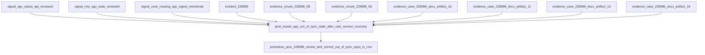

# post_restart_agv_out_of_sync_state_after_cat1_service_recovery

```mermaid
flowchart TD
  workflow[post_restart_agv_out_of_sync_state_after_cat1_service_recovery]
  agv_status_api_reviewed[signal_agv_status_api_reviewed] --> workflow
  rms_agv_state_reviewed[signal_rms_agv_state_reviewed] --> workflow
  zone_missing_agv_signal_mentioned[signal_zone_missing_agv_signal_mentioned] --> workflow
  workflow --> proc_228086_review_and_correct_out_of_sync_agvs_in_rms[procedure_proc_228086_review_and_correct_out_of_sync_agvs_in_rms]
  228086[incident_228086] --> workflow
  chunk_228086_08[evidence_chunk_228086_08] --> workflow
  chunk_228086_06[evidence_chunk_228086_06] --> workflow
  case_228086_docx_artifact_10[evidence_case_228086_docx_artifact_10] --> workflow
  case_228086_docx_artifact_11[evidence_case_228086_docx_artifact_11] --> workflow
  case_228086_docx_artifact_13[evidence_case_228086_docx_artifact_13] --> workflow
  case_228086_docx_artifact_16[evidence_case_228086_docx_artifact_16] --> workflow
```
