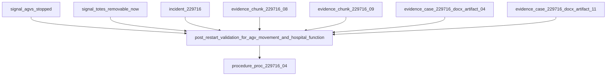

# post_restart_validation_for_agv_movement_and_hospital_function

```mermaid
flowchart TD
  workflow[post_restart_validation_for_agv_movement_and_hospital_function]
  agvs_stopped[signal_agvs_stopped] --> workflow
  totes_removable_now[signal_totes_removable_now] --> workflow
  workflow --> proc_229716_04[procedure_proc_229716_04]
  229716[incident_229716] --> workflow
  chunk_229716_08[evidence_chunk_229716_08] --> workflow
  chunk_229716_09[evidence_chunk_229716_09] --> workflow
  case_229716_docx_artifact_04[evidence_case_229716_docx_artifact_04] --> workflow
  case_229716_docx_artifact_11[evidence_case_229716_docx_artifact_11] --> workflow
```
