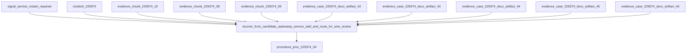

# recover_from_candidate_optisweep_service_stall_and_route_for_sme_review

```mermaid
flowchart TD
  workflow[recover_from_candidate_optisweep_service_stall_and_route_for_sme_review]
  service_restart_required[signal_service_restart_required] --> workflow
  workflow --> proc_229374_04[procedure_proc_229374_04]
  229374[incident_229374] --> workflow
  chunk_229374_10[evidence_chunk_229374_10] --> workflow
  chunk_229374_08[evidence_chunk_229374_08] --> workflow
  chunk_229374_09[evidence_chunk_229374_09] --> workflow
  case_229374_docx_artifact_42[evidence_case_229374_docx_artifact_42] --> workflow
  case_229374_docx_artifact_43[evidence_case_229374_docx_artifact_43] --> workflow
  case_229374_docx_artifact_44[evidence_case_229374_docx_artifact_44] --> workflow
  case_229374_docx_artifact_45[evidence_case_229374_docx_artifact_45] --> workflow
  case_229374_docx_artifact_46[evidence_case_229374_docx_artifact_46] --> workflow
```
