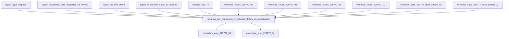

# recurring_agv_disconnect_or_induction_follow_on_investigation

```mermaid
flowchart TD
  workflow[recurring_agv_disconnect_or_induction_follow_on_investigation]
  agvs_stopped[signal_agvs_stopped] --> workflow
  disconnect_data_requested_for_review[signal_disconnect_data_requested_for_review] --> workflow
  no_rms_alarm[signal_no_rms_alarm] --> workflow
  ot_network_static_ip_required[signal_ot_network_static_ip_required] --> workflow
  workflow --> proc_229777_03[procedure_proc_229777_03]
  workflow --> proc_229777_04[procedure_proc_229777_04]
  229777[incident_229777] --> workflow
  chunk_229777_07[evidence_chunk_229777_07] --> workflow
  chunk_229777_08[evidence_chunk_229777_08] --> workflow
  chunk_229777_09[evidence_chunk_229777_09] --> workflow
  chunk_229777_10[evidence_chunk_229777_10] --> workflow
  case_229777_docx_artifact_01[evidence_case_229777_docx_artifact_01] --> workflow
  case_229777_docx_artifact_02[evidence_case_229777_docx_artifact_02] --> workflow
```
