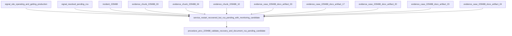

# service_restart_recovered_but_rca_pending_with_monitoring_candidate

```mermaid
flowchart TD
  workflow[service_restart_recovered_but_rca_pending_with_monitoring_candidate]
  site_operating_and_getting_production[signal_site_operating_and_getting_production] --> workflow
  resolved_pending_rca[signal_resolved_pending_rca] --> workflow
  workflow --> proc_229488_validate_recovery_and_document_rca_pending_candidate[procedure_proc_229488_validate_recovery_and_document_rca_pending_candidate]
  229488[incident_229488] --> workflow
  chunk_229488_03[evidence_chunk_229488_03] --> workflow
  chunk_229488_04[evidence_chunk_229488_04] --> workflow
  chunk_229488_10[evidence_chunk_229488_10] --> workflow
  case_229488_docx_artifact_03[evidence_case_229488_docx_artifact_03] --> workflow
  case_229488_docx_artifact_17[evidence_case_229488_docx_artifact_17] --> workflow
  case_229488_docx_artifact_20[evidence_case_229488_docx_artifact_20] --> workflow
  case_229488_docx_artifact_23[evidence_case_229488_docx_artifact_23] --> workflow
  case_229488_docx_artifact_24[evidence_case_229488_docx_artifact_24] --> workflow
```
