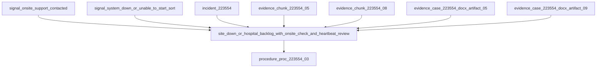

# site_down_or_hospital_backlog_with_onsite_check_and_heartbeat_review

```mermaid
flowchart TD
  workflow[site_down_or_hospital_backlog_with_onsite_check_and_heartbeat_review]
  onsite_support_contacted[signal_onsite_support_contacted] --> workflow
  system_down_or_unable_to_start_sort[signal_system_down_or_unable_to_start_sort] --> workflow
  workflow --> proc_223554_03[procedure_proc_223554_03]
  223554[incident_223554] --> workflow
  chunk_223554_05[evidence_chunk_223554_05] --> workflow
  chunk_223554_08[evidence_chunk_223554_08] --> workflow
  case_223554_docx_artifact_05[evidence_case_223554_docx_artifact_05] --> workflow
  case_223554_docx_artifact_09[evidence_case_223554_docx_artifact_09] --> workflow
```
