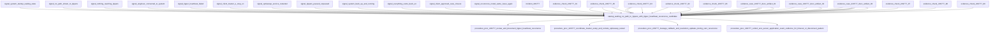

# startup_waiting_no_path_to_tippers_with_tipper_heartbeat_recurrence_candidate

```mermaid
flowchart TD
  workflow[startup_waiting_no_path_to_tippers_with_tipper_heartbeat_recurrence_candidate]
  system_startup_waiting_state[signal_system_startup_waiting_state] --> workflow
  no_path_shown_to_tippers[signal_no_path_shown_to_tippers] --> workflow
  nothing_reaching_tippers[signal_nothing_reaching_tippers] --> workflow
  engineer_connected_to_system[signal_engineer_connected_to_system] --> workflow
  tipper_heartbeat_failed[signal_tipper_heartbeat_failed] --> workflow
  client_master_e_stop_on[signal_client_master_e_stop_on] --> workflow
  optisweep_service_restarted[signal_optisweep_service_restarted] --> workflow
  tippers_paused_unpaused[signal_tippers_paused_unpaused] --> workflow
  system_back_up_and_running[signal_system_back_up_and_running] --> workflow
  everything_came_back_on[signal_everything_came_back_on] --> workflow
  client_approved_case_closure[signal_client_approved_case_closure] --> workflow
  recurrence_noted_same_issue_again[signal_recurrence_noted_same_issue_again] --> workflow
  workflow --> proc_229777_review_and_document_tipper_heartbeat_recurrence[procedure_proc_229777_review_and_document_tipper_heartbeat_recurrence]
  workflow --> proc_229777_coordinate_master_estop_and_remote_optisweep_restart[procedure_proc_229777_coordinate_master_estop_and_remote_optisweep_restart]
  workflow --> proc_229777_manage_callback_and_resolution_updates_during_cat1_recurrence[procedure_proc_229777_manage_callback_and_resolution_updates_during_cat1_recurrence]
  workflow --> proc_229777_collect_wcs_server_application_event_evidence_for_timeout_or_disconnect_pattern[procedure_proc_229777_collect_wcs_server_application_event_evidence_for_timeout_or_disconnect_pattern]
  229777[incident_229777] --> workflow
  chunk_229777_01[evidence_chunk_229777_01] --> workflow
  chunk_229777_02[evidence_chunk_229777_02] --> workflow
  chunk_229777_05[evidence_chunk_229777_05] --> workflow
  case_229777_docx_artifact_01[evidence_case_229777_docx_artifact_01] --> workflow
  case_229777_docx_artifact_03[evidence_case_229777_docx_artifact_03] --> workflow
  case_229777_docx_artifact_04[evidence_case_229777_docx_artifact_04] --> workflow
  chunk_229777_03[evidence_chunk_229777_03] --> workflow
  chunk_229777_05[evidence_chunk_229777_05] --> workflow
  case_229777_docx_artifact_01[evidence_case_229777_docx_artifact_01] --> workflow
  case_229777_docx_artifact_03[evidence_case_229777_docx_artifact_03] --> workflow
  chunk_229777_03[evidence_chunk_229777_03] --> workflow
  chunk_229777_06[evidence_chunk_229777_06] --> workflow
  case_229777_docx_artifact_01[evidence_case_229777_docx_artifact_01] --> workflow
  case_229777_docx_artifact_03[evidence_case_229777_docx_artifact_03] --> workflow
  case_229777_docx_artifact_04[evidence_case_229777_docx_artifact_04] --> workflow
  chunk_229777_03[evidence_chunk_229777_03] --> workflow
  chunk_229777_07[evidence_chunk_229777_07] --> workflow
  chunk_229777_08[evidence_chunk_229777_08] --> workflow
  case_229777_docx_artifact_01[evidence_case_229777_docx_artifact_01] --> workflow
  case_229777_docx_artifact_03[evidence_case_229777_docx_artifact_03] --> workflow
  case_229777_docx_artifact_04[evidence_case_229777_docx_artifact_04] --> workflow
  chunk_229777_02[evidence_chunk_229777_02] --> workflow
  chunk_229777_05[evidence_chunk_229777_05] --> workflow
  chunk_229777_09[evidence_chunk_229777_09] --> workflow
  case_229777_docx_artifact_01[evidence_case_229777_docx_artifact_01] --> workflow
  case_229777_docx_artifact_03[evidence_case_229777_docx_artifact_03] --> workflow
```
