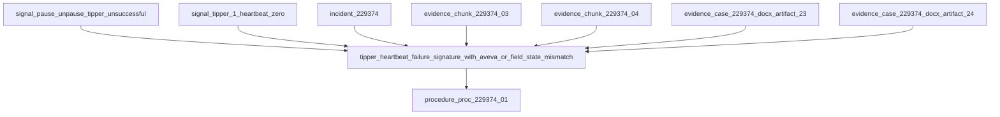

# tipper_heartbeat_failure_signature_with_aveva_or_field_state_mismatch

```mermaid
flowchart TD
  workflow[tipper_heartbeat_failure_signature_with_aveva_or_field_state_mismatch]
  pause_unpause_tipper_unsuccessful[signal_pause_unpause_tipper_unsuccessful] --> workflow
  tipper_1_heartbeat_zero[signal_tipper_1_heartbeat_zero] --> workflow
  workflow --> proc_229374_01[procedure_proc_229374_01]
  229374[incident_229374] --> workflow
  chunk_229374_03[evidence_chunk_229374_03] --> workflow
  chunk_229374_04[evidence_chunk_229374_04] --> workflow
  case_229374_docx_artifact_23[evidence_case_229374_docx_artifact_23] --> workflow
  case_229374_docx_artifact_24[evidence_case_229374_docx_artifact_24] --> workflow
```

