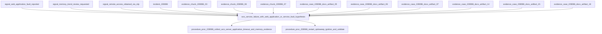

# wcs_service_failure_with_web_application_or_service_fault_hypothesis

```mermaid
flowchart TD
  workflow[wcs_service_failure_with_web_application_or_service_fault_hypothesis]
  web_application_fault_reported[signal_web_application_fault_reported] --> workflow
  memory_trend_review_requested[signal_memory_trend_review_requested] --> workflow
  remote_access_obtained_via_rdp[signal_remote_access_obtained_via_rdp] --> workflow
  workflow --> proc_228086_collect_wcs_server_application_timeout_and_memory_evidence[procedure_proc_228086_collect_wcs_server_application_timeout_and_memory_evidence]
  workflow --> proc_228086_restart_optisweep_ignition_and_validate[procedure_proc_228086_restart_optisweep_ignition_and_validate]
  228086[incident_228086] --> workflow
  chunk_228086_03[evidence_chunk_228086_03] --> workflow
  chunk_228086_06[evidence_chunk_228086_06] --> workflow
  chunk_228086_07[evidence_chunk_228086_07] --> workflow
  case_228086_docx_artifact_05[evidence_case_228086_docx_artifact_05] --> workflow
  case_228086_docx_artifact_06[evidence_case_228086_docx_artifact_06] --> workflow
  case_228086_docx_artifact_07[evidence_case_228086_docx_artifact_07] --> workflow
  case_228086_docx_artifact_14[evidence_case_228086_docx_artifact_14] --> workflow
  case_228086_docx_artifact_15[evidence_case_228086_docx_artifact_15] --> workflow
  case_228086_docx_artifact_18[evidence_case_228086_docx_artifact_18] --> workflow
```
