# Phase 0 Procedure Refinement Agent

## Purpose

The Procedure Refinement Agent is a future LLM-powered agent that runs after the Phase 0 Ingestion Agent. It reads case-derived procedure candidates, related incidents, evidence chunks, screenshots, and refinement gaps from the knowledge store, then proposes cross-incident procedure refinement candidates for SME review.

It does not approve procedures.
It does not replace SME review.
It does not write directly to approved runtime procedures.

## Inputs

- `procedure_dictionary` records with `procedure_refinement_status`
- `procedure_refinement_candidates` from prior refinement runs
- `incident_records`
- `timeline_events`
- `raw_evidence_chunks`
- `source_artifacts`
- `knowledge_relationships`
- screenshot artifact metadata and region refs

## Output Dataset

The agent writes proposed records to `procedure_refinement_candidates`.

These records represent a proposed cross-incident procedure synthesis, not an approved procedure. Each record should include:

- `candidate_family`
- `procedure_type`
- `title`
- `source_procedure_candidate_ids`
- `source_incident_ids`
- `source_evidence_refs`
- `merged_step_sequence`
- `screenshot_requirements`
- `known_variations`
- `missing_steps`
- `sme_questions`
- `status: needs_sme_review`
- `promotion_target: procedure_dictionary`

## Operating Flow

```mermaid
flowchart LR
  ProcedureCandidates["Case-Derived Procedure Candidates"] --> RetrieveRelatedEvidence["Retrieve Related Evidence"]
  RetrieveRelatedEvidence --> ClusterProcedureFamily["Cluster Procedure Family"]
  ClusterProcedureFamily --> SynthesizeSteps["Synthesize Candidate Step Sequence"]
  SynthesizeSteps --> AttachScreenshots["Attach Screenshot Requirements"]
  AttachScreenshots --> IdentifyGaps["Identify Missing Steps"]
  IdentifyGaps --> WriteRefinementCandidate["Write procedure_refinement_candidates"]
  WriteRefinementCandidate --> SMEReview["SME Review"]
```

## Guardrails

- Preserve source incident and evidence references for every proposed step.
- Distinguish case-supported steps from inferred gaps.
- Do not invent credentials, database names, table names, UI paths, server names, or log locations.
- If exact navigation is missing, write it to `missing_steps` or `sme_questions`.
- Require screenshot examples for steps that depend on visual recognition.
- Keep `status` as `needs_sme_review` until a human validates the procedure.
- Promote to `procedure_dictionary` only through an explicit SME review workflow.

## Example Candidate Family

`collect_database_timeout_evidence`

The agent should look for procedure candidates involving:

- WCS server access
- application event logs
- WCSWebApplication errors
- DbCommand timeout errors
- Entity Framework query errors
- SQL timeout messages
- timestamp and event ID capture
- screenshot evidence shared in case notes or Teams

The refined candidate should include concrete steps only when supported by one or more source cases. Missing details, such as exact database login steps or log export paths, must remain open SME questions.