# Phase 0 Architecture

Phase 0 uses a fixed FastAPI to LangGraph flow:

```mermaid
flowchart LR
  User[User] --> Api[FastAPI]
  Api --> Graph[LangGraph_Orchestrator]
  Graph --> Extract[Symptom_Extraction]
  Extract --> Retrieve[Local_CAT1_Retrieval]
  Retrieve --> Confidence[Workflow_Confidence]
  Confidence --> Workflow[YAML_Workflow]
  Workflow --> Escalation[Escalation_Rules]
  Escalation --> Response[Response_With_Citations]
```

The runtime graph is bounded. It extracts known CAT-1 signals, retrieves curated records, selects a workflow only when confidence is sufficient, loads steps from YAML, and applies deterministic escalation rules.

The Workflow Procedure Agent is separate from live troubleshooting. It supports manual curation by merging procedure and workflow candidates into reusable drafts for SME review.
