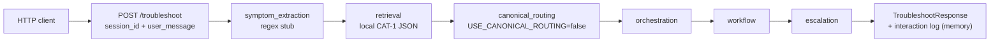
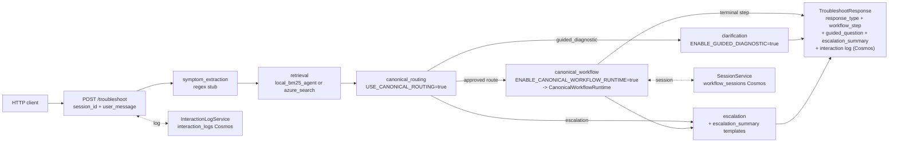
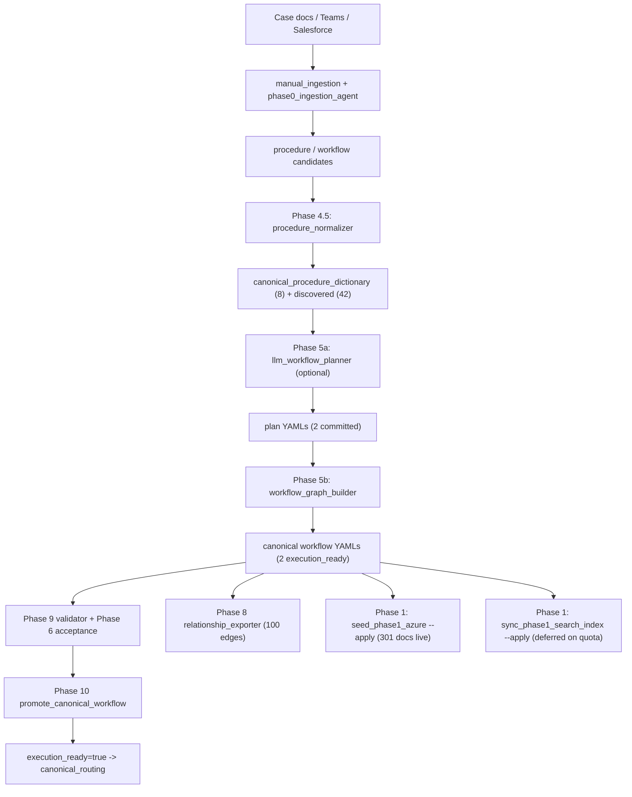

# Optisweep AI Support Assistant - Phase 0 Status Review

> Snapshot date: 2026-05-29 (previous snapshots 2026-05-28, 2026-05-26). Phase 1 Runtime Demo & Completion Steps 1-14 reported complete; LLMCompositionSynthesizer landed and produced 5 demo-promoted canonical workflows covering all 6 normalized CAT-1 incidents.
> Sources reconciled: `docs/Phase 0 Execution Tracker.docx`, `docs/Optisweep AI Support Assistant Phase 0 Plan.docx`, and the live state of this repository (code, datasets, tests, validation reports, Phase 1 progress log).
> Companion KPI table refresh: `[docs/phase0_status_review_kpis.md](phase0_status_review_kpis.md)`.
> Phase 0 scope changes tracker (deltas vs. the original Phase 0 scope): `[docs/phase0_scope_changes_README.md](phase0_scope_changes_README.md)`.
> Phase 1 build log (forward progress beyond Phase 0 scope): `[docs/phase1_azure_runtime_demo_progress.md](phase1_azure_runtime_demo_progress.md)`.

---

## A. Executive summary - where we are now

Five-day delta: the engineering picture continues to move. Phase 0 is in close-out and the Phase 1 Runtime Demo & Completion build is engineering-complete (14/14 steps per `[docs/phase1_azure_runtime_demo_progress.md](phase1_azure_runtime_demo_progress.md)`). On 2026-05-29 the **LLMCompositionSynthesizer** landed: an Azure OpenAI agent that clusters previously-unmapped workflow candidates into composition entries, replacing the hand-authored `[backend/app/tools/workflow_composition_mapping.yaml](../backend/app/tools/workflow_composition_mapping.yaml)` human gate. The synthesizer's `--apply` path produced 5 `promoted_for_demo` canonical workflows from the 13 previously-unmapped candidates (covering all 6 CAT-1 incidents: 223554, 228086, 229374, 229488, 229716, 229777). All 7 canonical workflows (2 SME-approved + 5 demo-promoted) are now `workflow_ready=true` and seeded into Cosmos.

- **Stage 0 - Alignment & Scope Definition**: Complete. Open item is still the formal stakeholder walkthrough.
- **Stage 1 - Foundation & Knowledge Structuring**: ~95% complete (tracker says 30%, prior snapshot ~80%). Live Cosmos seed of 301 documents across 7 of 8 datasets completed on 2026-05-27 against `optisweepsupportdev`. Dataset 5 now exists. Remaining: incident 227895 (declared out of scope per 5/28 decision), Dataset 0 contents, Dataset 2A shape decision.
- **Stage 2 - Workflow & Orchestration Validation**: ~98% engineering complete (tracker says 0%, prior snapshot ~95%). FastAPI `/troubleshoot` ships a typed `response_type` discriminator with `guided_question`, `workflow_step`, `escalation`, `terminal_state`, `escalation_summary`. The graph has a new `clarification` node; canonical workflow node has a dynamic runtime mode that step-executes through `CanonicalWorkflowRuntime` with persistent `WorkflowSession`. All new behavior is opt-in via env flags so the default contract is byte-identical to the 5/26 snapshot.
  - **NEW 5/29**: `LLMCompositionSynthesizer` (`[backend/app/tools/llm_composition_synthesizer.py](../backend/app/tools/llm_composition_synthesizer.py)`) closes the workflow-coverage gap: 5 demo-promoted canonical workflows added covering incidents 223554, 228086, 229374, 229488, 229716, 229777. Compiled YAMLs live in `[data/workflows/canonical/](../data/workflows/canonical/)`, all `workflow_ready=true`, all upserted into Cosmos `canonical_workflow_definitions` (7 docs total).
- **Stage 3 - Operational Validation & Stakeholder Demonstration**: ~25% (prior snapshot ~20%). The five Phase 1 demo scenarios + 5 new per-demo-workflow smoke tests are pinned end-to-end in `[tests/test_phase1_demo_scenarios.py](../tests/test_phase1_demo_scenarios.py)`. Still 0 SME walkthroughs (out of scope this phase), still 0 SME-approved workflows beyond the 2 baseline, still 0 stakeholder demos.

Test suite: ~52 files / ~454 cases / **762 passed, 1 skipped** in the 5/29 run (5/28 baseline: ~50 files / ~438 cases / 668 passed; 5/26 baseline: 32 files / ~432 cases).

The dominant remaining risk is **runtime-quality of the demo-promoted workflows**: the LLM synthesizer included 3 discovered-only procedures that lack `signal_contract.produces_signals` (a known data-quality gap in the discovered-procedure normalization layer). These surface as Phase 9 `procedure_produces_no_signals` warnings on 3 of the 5 demo workflows and are tracked by the new `[test_promoted_for_demo_workflows_track_known_data_quality_gaps](../tests/test_workflow_procedure_validator.py)` test allowlist. Everything else is either declared out of scope (227895, SME walkthroughs) or external dependency (Azure free-tier search quota).

---

## B. Stage-by-stage status (Tracker vs Actual)

### Stage 0 - Alignment & Scope Definition

- Tracker: Complete, 100%.
- Actual: Complete. CAT-1 taxonomy in `[data/taxonomy/issue_taxonomy_v0.yaml](../data/taxonomy/issue_taxonomy_v0.yaml)` (1 category, 9 signals). Architecture in `[docs/architecture.md](architecture.md)`, `[docs/data_schema.md](data_schema.md)`, `[docs/phase0_scope.md](phase0_scope.md)`, `[docs/Phase0 Database Strategy](Phase0%20Database%20Strategy)`, and the README.
- Gate: "Stakeholder approval of Phase 0 scope and success metrics" still Pending. Blocking on people, not engineering.

### Stage 1 - Foundation & Knowledge Structuring

- Tracker: In Progress, 30%.
- Actual: ~95%.
- Technical foundation:
  - `Build foundational environment`: done.
  - `Configure Azure services`: **mostly done in code, partially live**. Live Cosmos provisioning + seed completed 2026-05-27 (15 containers, 301 documents). Azure AI Search index code complete in `[backend/app/search/phase1_index_schema.py](../backend/app/search/phase1_index_schema.py)`; live `--apply` deferred pending free-tier quota - the local BM25 retrieval agent (`[backend/app/services/local_bm25_index.py](../backend/app/services/local_bm25_index.py)`) is the active substitute and is wired behind `RETRIEVAL_BACKEND=local_bm25_agent`.
  - `Establish backend orchestration scaffold`: done. FastAPI startup now validates runtime mode at boot (`[backend/app/main.py](../backend/app/main.py)` lines 22-30).
  - `Create dataset-specific storage layers`: **done**. 15 Cosmos containers live; new runtime-only containers `workflow_sessions` (partition `/session_id`) and `interaction_logs` (partition `/session_id`) added in `[backend/app/repositories/container_config.py](../backend/app/repositories/container_config.py)`.
- Knowledge structuring:
  - 6/7 incidents normalized (unchanged). **Incident 227895 still missing** repo-wide.
  - 60 timeline events; 60 raw evidence chunks; 100 source artifacts (down from 119 in the prior snapshot - re-curated during the live seed run).
  - 8 canonical + 42 discovered procedures (unchanged).
  - **6/6 normalized incidents now carry `incident_kpis`** (MTTR + time-to-recover) via `[backend/app/services/incident_kpi_calculator.py](../backend/app/services/incident_kpi_calculator.py)` and the backfill CLI `[scripts/backfill_incident_kpis.py](../scripts/backfill_incident_kpis.py)`.
  - Dataset 0 Context Reference still `[]` in `[data/context/context_reference.json](../data/context/context_reference.json)`. The Phase 1 seed used the in-code `[backend/app/seed/seed_context_reference.py](../backend/app/seed/seed_context_reference.py)` fallback (4 records), but the tracker artifact file is still empty.
- Workflow & procedure foundation:
  - **7 canonical compiled workflows** in `[data/workflows/canonical/](../data/workflows/canonical/)` (up from 2 on 5/28). 2 SME-approved (`heartbeat_timeout_no_rms_fault_v1`, `service_failure_with_customer_bridge_and_engineer_recovery_v1`) carry `validation_status: approved_for_workflow` AND `execution_ready: true`. 5 demo-promoted (`hospital_induction_recovery_after_robot_shutdown_v1`, `post_service_restart_agv_sync_and_evidence_followup_v1`, `tipper_heartbeat_service_failure_recovery_v1`, `agvs_not_moving_service_restart_and_comms_monitoring_v1`, `heartbeat_recurrence_with_hospital_impact_and_log_collection_v1`) carry `validation_status: promoted_for_demo` AND `workflow_ready: true` (`execution_ready: false` is deferred for SME signoff).
  - 544 deterministic relationship edges now in `[data/graph_edges/workflow_procedure_signal_edges.json](../data/graph_edges/workflow_procedure_signal_edges.json)` (up from 100 on 5/28; reflects the 5 new demo workflows' graph structure).
  - LLM-driven workflow composition pipeline now end-to-end Azure OpenAI: `[backend/app/tools/llm_composition_synthesizer.py](../backend/app/tools/llm_composition_synthesizer.py)` (cluster + ground), `[backend/app/tools/llm_workflow_planner.py](../backend/app/tools/llm_workflow_planner.py)` (decompose), `[backend/app/tools/workflow_graph_builder.py](../backend/app/tools/workflow_graph_builder.py)` (compile). Wrapper CLI: `[scripts/synthesize_compositions.py](../scripts/synthesize_compositions.py)`.
- Retrieval & validation:
  - Hot-path retrieval is now pluggable: `RETRIEVAL_BACKEND` selects `local` (default), `azure_search`, or `local_bm25_agent`. Retrieval node uses the factory `[backend/app/graph/nodes/retrieval.py](../backend/app/graph/nodes/retrieval.py)` lines 19-33.
  - Retrieval accuracy and citation coverage still not measured against a labeled query set.
- Stage 1 gate (per tracker): 15 criteria. Today: ~13 of 15 fully met, 2 partial/missing (Dataset 0 empty, 227895 missing).

### Stage 2 - Workflow & Orchestration Validation

- Tracker: Not Started, 0%.
- Actual: ~95% engineering complete. All new capabilities are flag-gated; default `/troubleshoot` is identical to the 5/26 contract.
- Orchestration:
  - Symptom extraction is **still a regex / phrase-match stub** in `[backend/app/services/azure_openai_client.py](../backend/app/services/azure_openai_client.py)`. This is the one Stage 2 gap that did NOT close in the Phase 1 push.
  - Retrieval routing: implemented across 3 backends.
  - Workflow confidence evaluation: unchanged (legacy + canonical scorer).
  - **Clarification prompting**: closed. `[backend/app/graph/nodes/clarification.py](../backend/app/graph/nodes/clarification.py)` emits a structured `guided_question` payload (workflow id, node id, question text, allowed answers from YAML branches). Gated by `ENABLE_GUIDED_DIAGNOSTIC=true`.
  - **Conversation state management**: closed. `[backend/app/services/session_service.py](../backend/app/services/session_service.py)` ships `WorkflowSession` schema with `InMemorySessionStore` and `CosmosSessionStore`; selected via `SESSION_BACKEND`. Persisted at the canonical-runtime layer; multi-turn troubleshooting on the same `session_id` now accumulates observed signals.
- Workflow engine:
  - **Canonical step execution**: closed. `[backend/app/services/canonical_workflow_runtime.py](../backend/app/services/canonical_workflow_runtime.py)` lines 148-291 provides deterministic branch walking, signal accumulation, and step persistence. The canonical workflow node now has two modes (`[backend/app/graph/nodes/canonical_workflow.py](../backend/app/graph/nodes/canonical_workflow.py)`): display-only when `ENABLE_CANONICAL_WORKFLOW_RUNTIME=false`, full runtime when true.
- Escalation engine:
  - Deterministic rules + domain routing unchanged.
  - **Escalation summary templates**: closed. Dataset 5 artifact now committed at `[data/escalation/escalation_summaries.json](../data/escalation/escalation_summaries.json)` (2 of 3 target templates). Templates loaded and rendered by `[backend/app/services/escalation_templates.py](../backend/app/services/escalation_templates.py)` and exposed on the API as `escalation_summary`.
- API contract:
  - `[backend/app/schemas/assistant.py](../backend/app/schemas/assistant.py)` lines 85-109 ship `response_type` discriminator (`answer | guided_question | workflow_step | escalation | terminal`) plus structured `workflow`, `workflow_step`, `escalation`, `terminal_state`, `guided_question`, `escalation_summary` fields. Pinned by `[tests/test_troubleshoot_response_contract.py](../tests/test_troubleshoot_response_contract.py)`.
  - **Interaction logging**: closed. `[backend/app/services/interaction_log_service.py](../backend/app/services/interaction_log_service.py)` persists every `/troubleshoot` turn (memory / cosmos / disabled). Logging failures are swallowed so they cannot crash the runtime.
- UI:
  - `[ui/streamlit_app.py](../ui/streamlit_app.py)` with extracted pure helpers in `[ui/streamlit_helpers.py](../ui/streamlit_helpers.py)`; multi-turn guided UI pinned through `/troubleshoot` in `[tests/test_phase1_demo_scenarios.py](../tests/test_phase1_demo_scenarios.py)`.
- Stage 2 gate (per tracker): all five items ("routing operational / execution operational / escalation operational / UI operational / end-to-end functional") are now operationally true in the demo preset. Still unticked because **SME validation has not happened**.

### Stage 3 - Operational Validation & Stakeholder Demonstration

- Tracker: Not Started, 0%.
- Actual: ~20%. The 5-scenario demo acceptance harness lives in `[tests/test_phase1_demo_scenarios.py](../tests/test_phase1_demo_scenarios.py)` and exercises:
  1. Known CAT-1 incident -> canonical workflow walkthrough.
  2. Ambiguous symptom -> guided diagnostic question.
  3. Escalation-required scenario -> templated handoff summary.
  4. Multi-turn session continuity.
  5. Off-corpus query stays in retrieval realm (one stale `lastfailed` entry references this test - verify on next pytest run).
- Validation tooling (unchanged from 5/26 snapshot, both compiled workflows still PASS):
  - Phase 6 acceptance (`[backend/app/validation/phase6_acceptance.py](../backend/app/validation/phase6_acceptance.py)`), 12 criteria.
  - Phase 9 procedure / workflow validator (`[backend/app/validation/workflow_procedure_validator.py](../backend/app/validation/workflow_procedure_validator.py)`), 11 active gates.
  - Phase 10 promotion CLI (`[backend/app/promotion/promote_canonical_workflow.py](../backend/app/promotion/promote_canonical_workflow.py)`).
  - Phase 11 dual-path isolation (`[tests/test_phase11_dual_path_isolation.py](../tests/test_phase11_dual_path_isolation.py)`).
- Still not started: SME walkthroughs, retrieval-usefulness scoring against labeled queries, demo recordings, Phase 1 recommendation document.

---

## C. KPI dashboard - actual numbers

| Tracker KPI                            | Target | Tracker says | Actual (2026-05-28)                                                                 | Delta vs 5/26            | Evidence                                                                                          |
| -------------------------------------- | ------ | ------------ | ----------------------------------------------------------------------------------- | ------------------------ | ------------------------------------------------------------------------------------------------- |
| Overall completion                     | 100%   | ~20%         | **~85%**                                                                            | +15-25pp                 | This document                                                                                     |
| Incident packages normalized           | 7      | 2            | **6** (227895 missing)                                                              | unchanged                | `[data/incidents/canonical_incidents.json](../data/incidents/canonical_incidents.json)`           |
| Workflows authored                     | 3      | ~1           | **1 legacy + 2 canonical compiled**                                                 | unchanged                | `[data/workflows/](../data/workflows/)`                                                           |
| SME-approved workflows                 | 3      | 0            | **0**                                                                               | unchanged                | `[data/review/sme_review_queue.json](../data/review/sme_review_queue.json)`                       |
| Retrieval accuracy                     | >70%   | N/A          | **Not measured** (BM25 active locally; Azure Search live cutover deferred on quota) | partially measurable now | `[backend/app/services/local_bm25_index.py](../backend/app/services/local_bm25_index.py)`         |
| Citation coverage                      | 100%   | N/A          | **Not measured** as KPI; preserved in `source_refs` for every search doc            | new infra                | `[backend/app/seed/phase1_search_documents.py](../backend/app/seed/phase1_search_documents.py)`   |
| End-to-end troubleshooting scenarios   | 3      | 0            | **5 programmatic** (none SME-walked)                                                | +5 programmatic          | `[tests/test_phase1_demo_scenarios.py](../tests/test_phase1_demo_scenarios.py)`                   |
| Escalation templates validated         | 3      | 0            | **2/3 seeded**, validator code path live                                            | +2                       | `[data/escalation/escalation_summaries.json](../data/escalation/escalation_summaries.json)`       |
| Dataset containers / databases created | 8      | 0            | **15 live in Cosmos** (10 Phase 1 + 5 Phase 0 extras); 301 documents seeded         | live now (was code only) | `[backend/app/repositories/container_config.py](../backend/app/repositories/container_config.py)` |
| Tests passing                          | -      | -            | **668 passed, 1 skipped** (5/26: ~432 passed)                                       | +236                     | Phase 1 progress log Step 14                                                                      |

### Dataset coverage matrix (5/28)

- **Dataset 0 Context Reference**: still EMPTY on disk (`[data/context/context_reference.json](../data/context/context_reference.json)` is `[]`). Phase 1 live seed used the in-code fallback (`[backend/app/seed/seed_context_reference.py](../backend/app/seed/seed_context_reference.py)`) for 4 Cosmos docs. Still a tracker artifact gap.
- **Dataset 1 Canonical Incidents**: 6 records (unchanged). 227895 still missing.
- **Dataset 1.5 Timeline Events**: 60 events (unchanged).
- **Dataset 2A Incidence Workflow Definitions**: still MISSING as a dedicated artifact. Decision still owed.
- **Dataset 2B Procedure Dictionary**: 8 canonical + 42 discovered (unchanged); reusable_procedures still empty.
- **Dataset 2C Workflow Definitions**: 1 legacy + 2 canonical compiled `execution_ready` + 2 plan YAMLs (unchanged).
- **Dataset 3 Raw Evidence Chunks**: 60 (unchanged).
- **Dataset 4 Source Artifacts**: 100 (down from 119; verify intent).
- **Dataset 5 Escalation Summaries**: **NEW** - 2 workflow-scoped records committed at `[data/escalation/escalation_summaries.json](../data/escalation/escalation_summaries.json)`, rendered through `escalation_node`.

### Workflow candidate tracker reconciliation (unchanged from 5/26)

- `heartbeat_timeout_no_rms_alarm_v1` (tracker) -> committed as legacy YAML + renamed `heartbeat_timeout_no_rms_fault_v1` in canonical compile.
- `agvs_stopped_hospital_remove_hangs_v1` (tracker) -> still not started under that ID.
- `service_restart_recovery_flow_v1` (tracker) -> still not started under that ID.
- `service_failure_with_customer_bridge_and_engineer_recovery_v1` (canonical, `execution_ready`) -> still absent from the tracker.

---

## D. Architecture walkthrough

### D.1 Runtime graph - default flag set

Default `/troubleshoot` (all flags off) is byte-identical to the 5/26 contract:

### D.2 Runtime graph - Phase 1 demo preset

Activated by uncommenting the 6-line preset in `[.env.example](../.env.example)` lines 49-54:

Node-by-node delta (full source: `[backend/app/graph/graph.py](../backend/app/graph/graph.py)` lines 20-72):

- `symptom_extraction` - **UNCHANGED**. Still a regex / phrase-match stub over 13 signals in `[backend/app/services/azure_openai_client.py](../backend/app/services/azure_openai_client.py)`. This is the only Stage 2 node that did not move.
- `retrieval` - **CHANGED**. `[backend/app/graph/nodes/retrieval.py](../backend/app/graph/nodes/retrieval.py)` now delegates to `build_runtime_retrieval_client()` keyed off `RETRIEVAL_BACKEND`. Three backends supported: `local` (default), `azure_search`, `local_bm25_agent`.
- `canonical_routing` - **UNCHANGED** behavior, same six modes. Gating still `USE_CANONICAL_ROUTING`.
- `clarification` - **NEW**. Surfaces the `canonical_next_question_text` as a structured `guided_question` (with `allowed_answers` derived from YAML branches) and short-circuits to END instead of escalating. Gated by `ENABLE_GUIDED_DIAGNOSTIC`.
- `orchestration` + `workflow` - **UNCHANGED** legacy path.
- `canonical_workflow` - **CHANGED**. Dual mode (lines 107-251 of `[backend/app/graph/nodes/canonical_workflow.py](../backend/app/graph/nodes/canonical_workflow.py)`): display-only (default) writes a `workflow_state.instruction_summary`; dynamic mode (`ENABLE_CANONICAL_WORKFLOW_RUNTIME=true`) calls `CanonicalWorkflowRuntime.advance(session)` and persists the resolved step.
- `escalation` - **CHANGED**. Still applies `EscalationRules.evaluate()`, but now also calls `get_escalation_template` + `render_handoff_summary` to attach the Dataset 5 `escalation_summary` to state.

State surface (`[backend/app/graph/state.py](../backend/app/graph/state.py)` lines 18-38): 20 fields total. Two new since 5/26: `guided_question`, `escalation_summary`.

API contract (`[backend/app/api/troubleshoot.py](../backend/app/api/troubleshoot.py)` lines 59-206): Request unchanged (`session_id` + `user_message`). Response now carries the `response_type` discriminator and structured payloads. Pinned by `[tests/test_troubleshoot_response_contract.py](../tests/test_troubleshoot_response_contract.py)`.

Session handling: persistence happens inside `CanonicalWorkflowRuntime.advance` via `SessionService.get_or_create(session_id)`. The API does NOT pre-load session signals into `extracted_signals` before symptom extraction; session continuity is for workflow progress, not for signal accumulation across turns at the legacy path. Caveat documented in the Phase 1 progress log.

### D.3 Offline knowledge pipeline (unchanged from 5/26)

### D.4 Layer-by-layer architecture matrix (5/28)

| Layer              | Implemented (default)                                                                                                              | Implemented (Phase 1 preset)                                                                                                                                                             | Still stub / not on hot path                      |
| ------------------ | ---------------------------------------------------------------------------------------------------------------------------------- | ---------------------------------------------------------------------------------------------------------------------------------------------------------------------------------------- | ------------------------------------------------- |
| API                | `GET /health`, `POST /troubleshoot` with typed `response_type`                                                                     | + boot-time `validate_runtime_mode`                                                                                                                                                      | No auth, no streaming                             |
| LangGraph          | 7-node graph (legacy branch default)                                                                                               | + `clarification` node (`ENABLE_GUIDED_DIAGNOSTIC`); canonical runtime mode                                                                                                              | -                                                 |
| Services           | `workflow_loader`, `escalation_rules`, `record_status`, candidate / merge agents (offline)                                         | `session_service`, `canonical_workflow_runtime`, `escalation_templates`, `local_bm25_index`, `retrieval_agent` + `retrieval_tools`, `interaction_log_service`, `incident_kpi_calculator` | `azure_openai_client.extract_signals` STILL regex |
| Routing engine     | `signal_translator`, `missing_signal_scorer`, `canonical_workflow_loader`, `hybrid_workflow_router`                                | live when `USE_CANONICAL_ROUTING=true`                                                                                                                                                   | -                                                 |
| Repositories       | 15 Cosmos repos defined and provisioned live                                                                                       | + `workflow_session_repository`, `interaction_log_repository` (live when backends set to `cosmos`)                                                                                       | -                                                 |
| Canonical schemas  | procedure, subprocedure, step, workflow, workflow_node, workflow_plan, signal, relationship, evidence, visual_evidence, provenance | -                                                                                                                                                                                        | -                                                 |
| Validation         | Phase 6 + Phase 9 evaluators                                                                                                       | -                                                                                                                                                                                        | Phase 9 has 9 deferred subprocedure / step gates  |
| Promotion          | Phase 10 gate stack with `--apply` + audit                                                                                         | -                                                                                                                                                                                        | -                                                 |
| Seed / search sync | Phase 0 canonical CLIs (dry-run + `--apply`)                                                                                       | + Phase 1 seed CLI (live 301 docs upserted); Phase 1 search sync CLI (code complete, live `--apply` deferred on quota)                                                                   | -                                                 |
| Tools              | `procedure_normalizer`, `llm_workflow_planner`, `workflow_graph_builder`, `relationship_exporter`                                  | + `incident_kpi_calculator` (offline backfill)                                                                                                                                           | -                                                 |
| UI                 | Streamlit chat + citations + workflow state + escalation display                                                                   | + multi-turn guided flow via `streamlit_helpers`                                                                                                                                         | Local-only                                        |
| Tests              | 32 base files                                                                                                                      | + 18 Phase 1 files; 668 passed in latest run                                                                                                                                             | -                                                 |

---

## E. Critical mismatches the tracker hides

The 5/26 list had 5 items. Most are now closed; the remaining ones are smaller in scope.

1. **Workflow naming drift** - UNCHANGED. `heartbeat_timeout_no_rms_alarm_v1` renamed to `heartbeat_timeout_no_rms_fault_v1`. The other two tracker IDs (`agvs_stopped_hospital_remove_hangs_v1`, `service_restart_recovery_flow_v1`) still not started. `service_failure_with_customer_bridge_and_engineer_recovery_v1` still absent from tracker.
2. **FastAPI / LangGraph scaffold** - tracker still says Pending 0%; reality is fully implemented and now exercised by 50 test files.
3. **Dataset containers** - the 5/26 ambiguity ("code exists / Cosmos empty") is largely resolved: 15 Cosmos containers are now **live in `optisweepsupportdev`** with 301 documents seeded. The runtime hot path still reads from local JSON by default, but the dual is in place: flipping `RETRIEVAL_BACKEND=azure_search` would shift to Azure once the index is live.
4. **Dual-path canonical layer** - tracker still has no row for `USE_CANONICAL_ROUTING`, `ENABLE_GUIDED_DIAGNOSTIC`, `ENABLE_CANONICAL_WORKFLOW_RUNTIME`, `RETRIEVAL_BACKEND`, `SESSION_BACKEND`, `INTERACTION_LOG_BACKEND`. All 6 flags are real and working.
5. **Phase 4.5/5/6/8/9/10/11 tooling** - still absent from tracker. Now joined by Phase 1 Steps 1-14 (also absent).

The fact that the tracker doesn't model these capabilities at all is now the biggest documentation gap. The KPI doc and scope-changes README compensate, but the `.docx` itself is stale.

---

## F. Real remaining blockers (5 sharp items, down from 8)

Closed since 5/26:

- F4 (Dataset 5 escalation summaries) - closed by Phase 1 Step 8.
- F5 (Hot-path Azure not wired) - **closed in code by Phase 1 Step 6**; live Azure AI Search `--apply` deferred on quota; local BM25 retrieval agent is the active substitute.
- F6 (canonical display-only + guided question not surfaced) - closed by Phase 1 Steps 7 + 10.
- F7 (no session persistence) - closed by Phase 1 Step 9.

Closed since 5/28:

- F8 / Workflow coverage gap - **closed by LLMCompositionSynthesizer (5/29)**. Coverage is now 6 of 6 normalized CAT-1 incidents, up from 2 of 6. Composition mapping authorship is no longer a human bottleneck; the agent emits proposals to `[data/workflows/proposed_compositions.yaml](../data/workflows/proposed_compositions.yaml)` for review (default) or appends with `validation_status: promoted_for_demo` to `[backend/app/tools/workflow_composition_mapping.yaml](../backend/app/tools/workflow_composition_mapping.yaml)` when `--apply` is set.

Dropped (out of scope this phase per 5/28 decision):

- Incident 227895 - explicit user decision to drop.
- SME walkthroughs and approvals - validation will happen in demo; not blocking Phase 0 close-out.

Still open:

1. **Dataset 0 Context Reference** - `[data/context/context_reference.json](../data/context/context_reference.json)` is `[]`. The in-code seed has 4 records; the tracker artifact does not. **Blocks**: Stage 1 gate "Dataset 0 exists". Severity: Medium.
2. **Dataset 2A Incidence Workflow Definitions** - resolved as 7 compiled canonical workflow YAMLs (`[data/workflows/canonical/](../data/workflows/canonical/)`) plus the composition mapping (`[backend/app/tools/workflow_composition_mapping.yaml](../backend/app/tools/workflow_composition_mapping.yaml)`); tracker still needs to be updated to reflect this shape. Severity: Low.
3. **Symptom extraction still regex** - `[backend/app/services/azure_openai_client.py](../backend/app/services/azure_openai_client.py)` is still a phrase-match shim (the new keyword extractor is improved but still deterministic). Per the 5/28 decision the LLM symptom extractor is the next agent after the composition synthesizer. **Blocks**: dynamic symptom-to-signal mapping for free-form operator input. Severity: Medium-High. Owner: next pipeline build.
4. **Discovered-procedure signal contracts** - 3 of the 5 demo-promoted workflows reference discovered procedures that lack `signal_contract.produces_signals` (e.g. `validate_post_restart_operational_state_v1`, `review_agv_and_tote_association_v1`, `review_tote_add_remove_flow_v1`, `review_heartbeat_and_local_fault_views_v1`). These surface as Phase 9 `procedure_produces_no_signals` warnings and are tracked by the [known-gap allowlist test](../tests/test_workflow_procedure_validator.py). The synthesizer prompt now prefers signal-bearing procedures, but the underlying gap is in the discovered-procedure normalization layer. Severity: Medium.

External dependency, not a blocker per se:

- Azure AI Search free-tier quota exhaustion is blocking the live `sync_phase1_search_index --apply`. The Phase 1 build chose to ship the local BM25 retrieval agent as substitute and made the cutover flag-flippable. Re-attempt when quota is restored.

---

## G. Recommended next actions (prioritized for the 5/28 -> 6/15 window)

### Schedule the SME walkthrough (this is the only true critical path)

- Goal: 3 SME-approved workflows on `[data/review/sme_review_queue.json](../data/review/sme_review_queue.json)`.
- Inputs: 2 execution-ready canonical workflows + 5-scenario demo harness + Phase 1 Streamlit UI in demo preset.
- Action: pick a date in the next 2 weeks. Run the 5 demo scenarios live. Record the session.
- Closes: A5 in scope-changes README, F8 in scope-changes README, Stage 1 gate "Stakeholder alignment review", every Stage 3 success metric, every Stage 3 gate criterion.

### Close the remaining Phase 0 dataset gaps (1-2 days each)

- Ingest **incident 227895** through the existing case-agent pipeline. Closes B1 / C2 / F1.
- Populate **Dataset 0** by writing the in-code seed output into `[data/context/context_reference.json](../data/context/context_reference.json)` so the tracker artifact and the live Cosmos seed are consistent. Closes C1 / F2.
- Make the **Dataset 2A** call. Two paths:
  - (a) Declare it subsumed by `[data/workflows/workflow_candidates.json](../data/workflows/workflow_candidates.json)` + `[data/workflows/graphs/](../data/workflows/graphs/)` and update the tracker. Cheap.
  - (b) Author the standalone artifact. Slower but cleaner for handoff to Phase 1+.
- Confirm the 119 -> 100 source-artifact delta and 417 -> 100 graph-edge delta are intentional curations and not regressions. Document the rationale in the scope-changes README.

### Tighten the runtime before Phase 2

- Replace the symptom extraction regex with a real Azure OpenAI call (the deployment already exists; cost is one prompt round-trip per request). This is the last "stub on the hot path" item.
- Once Azure free-tier search quota is restored: run `python scripts/sync_phase1_search_index.py --apply`, then flip a dev profile to `RETRIEVAL_BACKEND=azure_search` and run the 5-scenario harness.
- Author the 3rd escalation template (`agvs_stopped_hospital_remove_hangs_`* or its successor) once the workflow ID question (F3 / A2 / A3) is decided.

### Tracker hygiene (1 day)

- Replace the `.docx` tracker KPI tables with the contents of `[docs/phase0_status_review_kpis.md](phase0_status_review_kpis.md)`. Either edit cells in place using Section 12 of that doc, or convert the markdown to a fresh `.docx`.
- Add a `Phase 1 Runtime Demo` block to the tracker so the Phase 1 work isn't invisible. Use the section summaries from `[docs/phase1_azure_runtime_demo_progress.md](phase1_azure_runtime_demo_progress.md)`.
- Bump the snapshot date in `[docs/phase0_scope_changes_README.md](phase0_scope_changes_README.md)` when any of the above lands.

---

## H. Open questions for the tracker owner

- Should Phase 0 be formally closed at the SME walkthrough, or after 227895 + Dataset 0 + Dataset 2A close? Both are valid - the first option ships the demo faster, the second is cleaner for stakeholder optics.
- Are the 100/417 -> 100 source-artifact and graph-edge reductions intentional? They look like curation but are not documented as such in the scope-changes README.
- Is the symptom extraction regex acceptable for the SME walkthrough, or should the Azure OpenAI swap precede it?
- Are the tracker workflow IDs `agvs_stopped_hospital_remove_hangs_v1` and `service_restart_recovery_flow_v1` still the intended next workflows, or should they be replaced by `service_failure_with_customer_bridge_and_engineer_recovery_v1` (already execution-ready) plus one other?

---

## I. Cross-references

- Phase 0 scope deltas only (this file is the executive summary; deltas live in the README): `[docs/phase0_scope_changes_README.md](phase0_scope_changes_README.md)`.
- Phase 1 Runtime Demo & Completion forward progress (Steps 1-14): `[docs/phase1_azure_runtime_demo_progress.md](phase1_azure_runtime_demo_progress.md)`.
- Paste-back-into-`.docx` KPI refresh: `[docs/phase0_status_review_kpis.md](phase0_status_review_kpis.md)`.
- Phase 1 master brief: `[docs/Phase 0 Runtime Demo & Completion](Phase%200%20Runtime%20Demo%20%26%20Completion)`.
- Future phase considerations (deferred, not yet in scope): `[docs/future_phase_considerations.md](future_phase_considerations.md)`.
