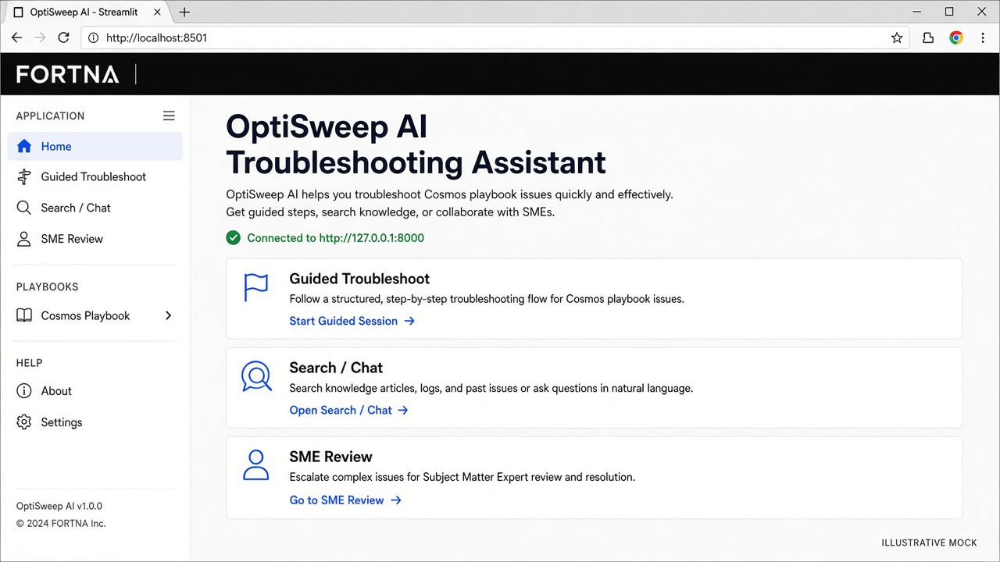
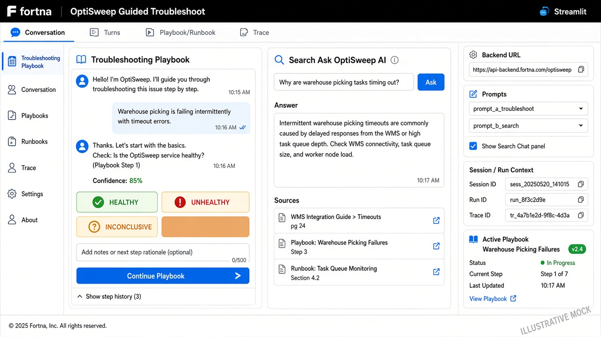
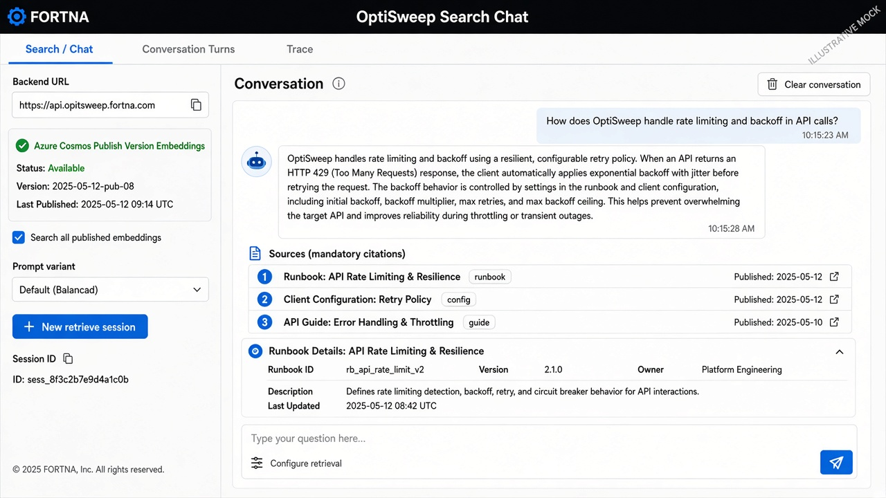
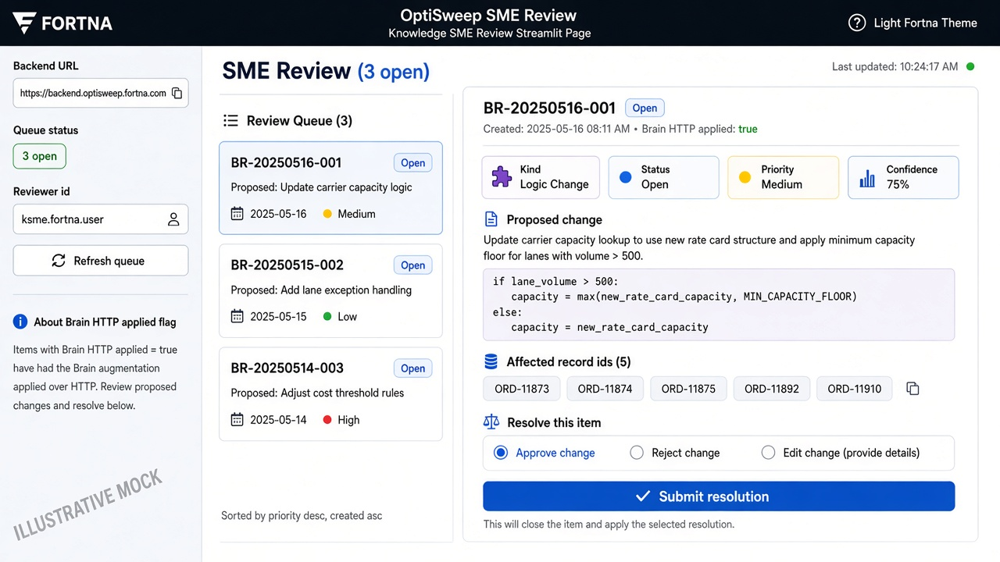

# Streamlit UI — how it works

Handoff guide for the OptiSweep operator / SME surfaces. The UI is a thin
Streamlit client over the FastAPI app. It does **not** talk to Cosmos or Brain
directly — every durable call goes through `API_BASE_URL`.

```powershell
# Terminal 1 — API
uvicorn backend.app.main:app --reload

# Terminal 2 — UI
streamlit run ui/Home.py
```

Set `API_BASE_URL` if the API is not `http://127.0.0.1:8000`.
Compat entry: `ui/streamlit_app.py` forwards to `Home.py`.

Product overview: [`../README.md`](../README.md) · Azure move:
[`../AZURE_ACCOUNT_HANDOFF.md`](../AZURE_ACCOUNT_HANDOFF.md) · Ingestion deps:
[`../docs/INGESTION_DEPENDENCIES.md`](../docs/INGESTION_DEPENDENCIES.md) ·
Brain contract: [`../docs/brain/HTTP_BOUNDARY.md`](../docs/brain/HTTP_BOUNDARY.md).

---

## Screenshots (illustrative mocks)

> Live captures were not available when this handoff pack was written. Images
> below are **illustrative mocks** (Fortna light theme, `#2B5CFF` accent, black
> header). Replace with real screenshots under `docs/screenshots/` when you can.

### Home



Landing page: what each surface is for, Haslet site link, backend health check.

### Guided Troubleshoot (dual pane)



Conversation tab: playbook on the left, contextual Search Chat on the right.
Branch buttons are deterministic; Search never advances the playbook unless the
operator confirms **Use this result in current troubleshooting step**.

### Search / Chat



Standalone corpus Q&A with mandatory Sources citations and Cosmos status in the
sidebar. Playbook and runbook hits render as expandable panels in chat; **how-to**
questions preferentially surface and expand runbook panels.

### SME Review



Knowledge-owner pull queue for BrainReviews (requires Brain HTTP review flags).

---

## Architecture: UI ↔ API ↔ backends

```text
Streamlit (ui/)
    │  HTTP  API_BASE_URL
    ▼
FastAPI (backend.app.main)
    ├─ Publish corpus path (primary)     → Cosmos Stage 11 containers
    │                                      (playbooks, runbooks, embeddings, …)
    ├─ Sessions / turn logs / feedback   → Cosmos workflow_sessions,
    │                                      interaction_logs, feedback_events
    ├─ Attachments                       → Blob + Azure Vision
    └─ Optional Brain HTTP overlay       → ingestion-hosted Brain API
                                           (no app writes to brain_* )
```

### Backend selectors (API env — UI only sees effects)

| Concern | Env | Values | What the UI notices |
|---------|-----|--------|---------------------|
| Corpus / retrieval | `RETRIEVAL_BACKEND` | `cosmos` (demo) | Search sidebar shows Azure Cosmos + embedding counts |
| Playbook sessions | `SESSION_BACKEND` | `cosmos` \| `memory` | Pin/node state survives restart only on `cosmos` |
| Turn audit | `INTERACTION_LOG_BACKEND` | `cosmos` \| `memory` | **Turns** tabs replay history |
| Feedback store | `FEEDBACK_BACKEND` | `cosmos` \| `memory` \| `disabled` | Thumbs / suggestion widgets persist |
| Brain master switch | `BRAIN_HTTP_ENABLED` | default `false` | Gates all Brain client calls |
| Brain retrieve overlay | `BRAIN_HTTP_RETRIEVE` | default `false` | Search answers may include Brain hydrated excerpts as cited evidence; cold Brain can be slow |
| Brain troubleshoot overlay | `BRAIN_HTTP_TROUBLESHOOT` | default `false` | Supplemental context / routing-learning handoff |
| Brain feedback forward | `BRAIN_HTTP_FEEDBACK` | default `false` | Feedback may show Brain handoff / review id |
| Brain SME queue | `BRAIN_HTTP_REVIEWS` | default `false` | SME Review page works vs disabled warning |
| Brain host | `BRAIN_HTTP_BASE_URL` | ingestion ACA URL | Required when any Brain flag is on |
| Brain timeout | `BRAIN_HTTP_TIMEOUT_SECONDS` | `90` | Covers v4 cold retrieve (~40–50s); warm ~2s |
| Brain startup warmup | `BRAIN_HTTP_WARMUP_ON_STARTUP` | default `true` | Background probe so first user turn is more likely warm |

Inspect live flags: `GET {API_BASE_URL}/debug/settings`.

### What the app does **not** do

- Upsert `brain_*` Cosmos containers (Brain owns mutation).
- Treat MCP as the product UI transport.
- Present `operational_unreviewed` Brain material as SME-approved (it may appear
  in Search answers only when labeled **operational unreviewed**).
- Let technicians approve BrainReviews (SME Review is for knowledge owners).
- Replace the playbook step machine with Brain drafts.
- Treat Brain retrieve as a knowledge graph. Relationships in Brain responses are
  mostly evidence/citation links, not a dictating relationship model the app walks.
- Confuse Brain retrieve with publish `relationship_links` (playbook→runbook for
  Guided Troubleshoot).

### Brain retrieve overlay (Search / Chat)

When Brain retrieve is enabled, Search may merge Brain **hydrated excerpts** into
answer synthesis as supplemental cited evidence (approved preferred;
`operational_unreviewed` only when labeled). The app does **not** build or use a
knowledge-graph neighborhood.

Publish playbook→runbook links (`relationship_links` in Cosmos) remain for Guided
Troubleshoot only.

---

## Pages and APIs

| Page | File | Primary APIs |
|------|------|----------------|
| Home | `Home.py` | `GET /health` |
| Guided Troubleshoot | `pages/1_Guided_Troubleshoot.py` | `POST /troubleshoot`, embedded `POST /retrieve`, `GET /corpus/...`, `GET /troubleshoot/sessions/{id}/interactions`, `POST /attachments/upload`, `POST /feedback` |
| Search / Chat | `pages/2_Search_Chat.py` | `POST /retrieve`, `GET /corpus/status`, `GET /retrieve/sessions/{id}/interactions`, attachments + feedback |
| SME Review | `pages/3_SME_Review.py` | `GET /debug/settings`, `GET /reviews`, `GET /reviews/{id}`, `POST /reviews/{id}/resolve` |

Shared modules: `playbook_ui.py` (HTTP + render), `playbook_graph.py` (graph viz),
`feedback_ui.py`, `streamlit_helpers.py`, `branding.py` + `static/`.

Theme: `.streamlit/config.toml` + `branding.py` (Fortna black header, `#2B5CFF`).

---

## Session IDs (important for handoff)

| Surface | Session id pattern | Stored where |
|---------|--------------------|--------------|
| Guided Troubleshoot | `ts-<12 hex>` | Streamlit state + API `SESSION_BACKEND` |
| Embedded Search Chat (on Troubleshoot) | `{ts-id}-search` | Separate retrieve session — does not share playbook pin |
| Standalone Search / Chat | `rt-<12 hex>` | Retrieve memory + interaction logs |

**New session** buttons in sidebars rotate ids and clear local chat history.
Playbook pin/node only reset for the troubleshoot session.

---

## Home


- Explains when to use each page.
- Links [UPS – Haslet TX](https://fortna.atlassian.net/wiki/spaces/DS/pages/3064266909/UPS+-+Haslet+TX).
- Health-checks `API_BASE_URL`.

---

## Guided Troubleshoot

**Use when:** working a live incident step-by-step.

### Sidebar

- Backend URL, Prompt A/B (`playbook_variant` on every troubleshoot request).
- **Show Search Chat panel** (dual pane on/off).
- Troubleshoot + Search Chat session ids.
- **Active playbook** card (title, id, current node, progress).
- If resolution is `unpinned` / `awaiting_candidate`, caption notes Brain
  routing-learning handoff when Brain feedback is enabled.

### Tabs

| Tab | Contents |
|-----|----------|
| Conversation | Dual pane when Search panel on: playbook main + Search Chat |
| Turns | Replay from `interaction_logs` (troubleshoot + search sessions) |
| Playbook / Runbook | Interactive graph + node detail + linked runbook panels/images |
| Trace | Raw JSON (`runtime_trace`, last search payload, bridge events) |

### Playbook pane behavior

1. Free-text symptoms → `POST /troubleshoot` → candidates or pin (thresholds on API).
2. Candidate buttons / branch **exact labels** → deterministic advance (no branch LLM).
3. Free-text on a branch → may call branch LLM (`ENABLE_LLM_BRANCH_MATCH`).
4. Node view: objective, audience, action, suggested DB checks, evidence criteria,
   runbook expanders with step images.
5. Optional image upload → `POST /attachments/upload` → `attachment_ids` on next turn.
6. Feedback widgets → `POST /feedback` (local Cosmos + optional Brain forward).

### Dual-pane Search Chat rules

- Uses `{troubleshoot_session}-search`.
- Sends compact `search_context` (playbook/node/runbook/symptoms) — **read-only**.
- Always includes Cosmos `operational_context` when present in the index.
- Asking a question **never** mutates `workflow_state`.
- If a hit maps to an allowed branch value, UI may offer
  **Use this result in current troubleshooting step** → then `POST /troubleshoot`
  with that confirmed value (explicit bridge).

---

## Search / Chat

**Use when:** corpus Q&A without executing a playbook.

### Sidebar

- Backend URL + `GET /corpus/status` (must report `source=cosmos` for demos).
- Embedding totals / per-type counts; warns if `operational_context` is empty.
- **Search all published embeddings** (default on). Narrowing still keeps
  operational context rules on the API.
- Prompt variant (prefer A or B playbook hits when ranking).
- Image / full-detail toggles; new session button.

### Tabs

| Tab | Contents |
|-----|----------|
| Conversation | Answer + **Sources** (always when hits exist) + hit panels |
| Turns | Retrieve interaction log timeline |
| Trace | Raw hits / scores / `runtime_trace` |

Hybrid scores are **relative rank** (`0.7×cosine + 0.3×jaccard` + boosts), not
confidence percentages. Feedback and image upload work the same as Troubleshoot.

When `BRAIN_HTTP_RETRIEVE` is on, the API may merge Brain **approved** excerpts
into citations. Unreviewed Brain material must not be presented as trusted
guidance.

---

## SME Review

**Use when:** you are an OptiSweep **knowledge SME** approving BrainReviews.
Technicians on Guided/Search are **not** approvers.

### Requirements

```text
BRAIN_HTTP_ENABLED=true
BRAIN_HTTP_REVIEWS=true
BRAIN_HTTP_BASE_URL=https://<brain-host>
```

If flags are off, the page shows a warning + current `/debug/settings` snippet and stops.

### Layout

- Sidebar: backend URL, queue status (`open` / `resolved`), limit, reviewer id, refresh.
- Left: pull queue from `GET /reviews`.
- Right: detail from `GET /reviews/{id}`; resolve via `POST /reviews/{id}/resolve`
  (`approve` / `reject` / `edit`).

### Resolve semantics (UI copy)

| Brain outcome | What UI emphasizes |
|---------------|--------------------|
| `applied=true` (e.g. MERGE) | Corpus **did** change — `mutated_record_ids` shown |
| `applied=false` (e.g. some RETYPE/RECLASSIFY) | Accepted but not executed / pending tooling |
| Reject | Trusted cite set unchanged |

`applied` is the source of truth for whether Brain mutated records. Deep
contract: [`../docs/brain/HTTP_BOUNDARY.md`](../docs/brain/HTTP_BOUNDARY.md).

Deep-link: `?review_id=<id>` preselects a queue row when present.

---

## Brain & continuous learning (handoff)

Brain lives in the **ingestion** repo. This app is an HTTP **client** only.
Full two-repo dependency map (Stage 11 publish, embeddings, Brain, cutover
checklist): [`../docs/INGESTION_DEPENDENCIES.md`](../docs/INGESTION_DEPENDENCIES.md).

### Dual path (publish corpus + Brain)

| Path | Role today |
|------|------------|
| **Publish corpus** (Cosmos Stage 11) | **Primary** — playbook pin, hybrid search, node/runbook execution |
| **Brain HTTP** (feature-flagged) | **Overlay** — extra approved context, feedback Create-path, SME reviews |

Do not turn off publish retrieval until Brain quality is signed off. Flags
default **off** in `.env.example`; live Container App YAML may turn them **on**
against a Brain URL — update that URL on account transfer.

### Learning loop the UI participates in

```text
Operator uses Guided Troubleshoot / Search
    → InteractionLog (Cosmos) for every turn
    → optional FeedbackEvent (helpful / not_helpful / suggestion + images)
         → always saved in app Cosmos first
         → if BRAIN_HTTP_FEEDBACK: POST /brain/v1/feedback
              → Brain may write operational_unreviewed / conflicting
              → brain_review_id returned for audit (not the same as “approved”)
SME opens SME Review
    → GET /reviews (open queue)
    → POST /reviews/{id}/resolve
         → MERGE may apply for real (deprecate losers, merge into winner)
         → RETYPE/RECLASSIFY may be accepted-not-executed
Approved guidance only then becomes citable as trusted OptiSweep knowledge
```

### What operators should be told in UI copy

| Situation | Correct message |
|-----------|-----------------|
| Feedback submitted, Brain off | Saved for audit locally; not yet in Brain |
| Feedback submitted, Brain on | Accepted; may already exist in Brain as **unreviewed** |
| Answer cites publish corpus | Normal playbook/runbook guidance |
| Answer includes Brain approved excerpts | Trusted only if status is approved / SME-approved class |
| Never | “Saved as trusted OptiSweep knowledge” on feedback alone |

Feedback/attachments contract:
[`../docs/brain/FEEDBACK_CAPTURE.md`](../docs/brain/FEEDBACK_CAPTURE.md).

### Feature-flag cheat sheet for demos

| Goal | Flags |
|------|-------|
| Classic publish-only demo | All `BRAIN_HTTP_*=false` |
| Search + Brain citations | `ENABLED` + `RETRIEVE` + `BASE_URL` |
| Feedback into Brain | `ENABLED` + `FEEDBACK` |
| SME queue | `ENABLED` + `REVIEWS` |
| Full overlay | All Brain route flags `true` (expect slow cold retrieve) |

---

## Feedback & attachments (all chat surfaces)

Implemented in `feedback_ui.py`:

1. Optional image upload → `POST /attachments/upload` (Blob + Vision →
   `image_summary`).
2. Chat/troubleshoot turn may pass `attachment_ids`; API enriches the operator
   text before runtime.
3. After an assistant turn with `interaction_id`, feedback controls call
   `POST /feedback` with targets (playbook/runbook/node/record ids).
4. UI may show image summaries and Brain handoff fields from the response when
   present.

---

## File map

| Path | Role |
|------|------|
| `Home.py` | Landing + health |
| `pages/1_Guided_Troubleshoot.py` | Playbook + dual-pane search |
| `pages/2_Search_Chat.py` | Standalone retrieve |
| `pages/3_SME_Review.py` | BrainReview queue |
| `playbook_ui.py` | HTTP helpers + rich panels |
| `playbook_graph.py` | Graph + branch controls |
| `feedback_ui.py` | Upload + feedback widgets |
| `streamlit_helpers.py` | Labels, keys, progress |
| `branding.py` / `static/` | Fortna theme assets |
| `docs/screenshots/` | Handoff screenshots (mocks or live) |

---

## Quick smoke checklist

1. Home shows Connected to backend.
2. Search / Chat sidebar: Cosmos + `embedding_total > 0`.
3. Guided Troubleshoot: symptom → candidates/pin; branch button advances node.
4. Search panel question does **not** change node until bridge confirm.
5. Feedback submits without error; with Brain feedback on, handoff status updates.
6. SME Review: with flags on, open queue loads; with flags off, clear disable message.
